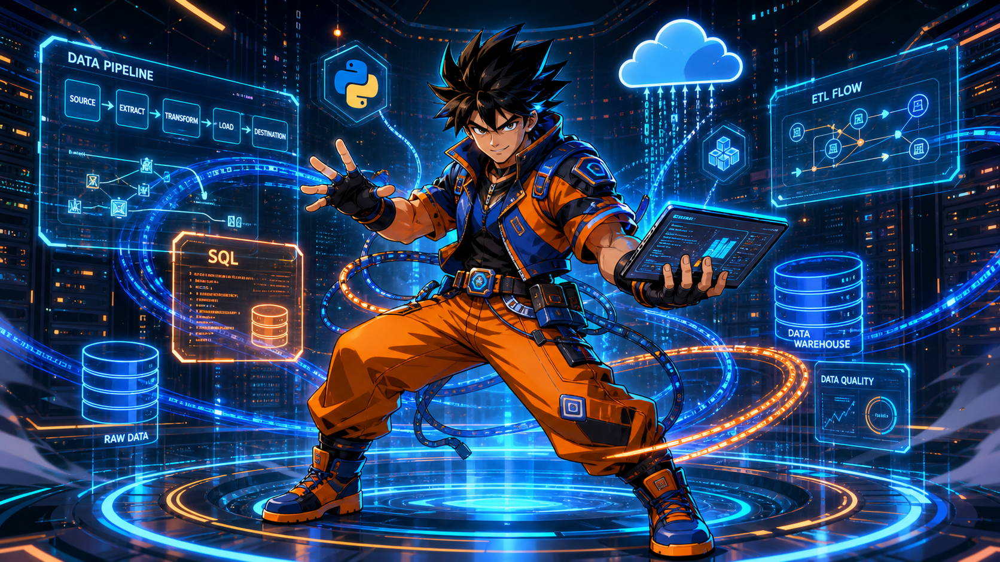
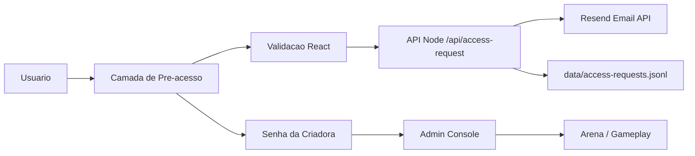

<div align="center">

# CODE KI ARENA TEC - GAMEPLAY

### Plataforma gamificada de programacao com arena 3D, cadastro seguro e trilhas de desafios.




</div>

---

## Visao Geral

**Code Ki ARENA TEC** e um projeto web interativo que une jogo, educacao em tecnologia, experiencia visual e fluxo seguro de pre-acesso. O usuario solicita acesso por uma camada inicial validada, enquanto a criadora acessa o console administrativo por senha.

O projeto foi desenhado para demonstrar dominio em **frontend moderno**, **logica de jogos**, **validacao de formularios**, **backend seguro**, **envio transacional de email**, **automacao de assets** e **organizacao de dados educacionais em larga escala**.

---

## Destaques Para Recrutadores

| Area | Evidencia no projeto |
| --- | --- |
| Frontend Engineering | React, Vite, componentizacao, estados, formularios e UX responsiva |
| Game UI / Gameplay | Arena 3D, personagens, boss battle, XP, moedas, progresso e feedback visual |
| Dados Educacionais | CSVs com milhares de perguntas e desafios por linguagem |
| Backend Seguro | Endpoint Node.js para solicitacao de acesso e envio de email sem expor secrets |
| Seguranca Aplicada | Validacao dupla, honeypot, rate limit simples, bloqueio de admin por senha |
| Automacao | Scripts para gerar assets, gravar tours, testar email e configurar ambiente |
| Documentacao | Guia de email transacional, variaveis de ambiente e scripts de teste |

---

## Numeros Do Projeto

| Metrica | Quantidade |
| --- | ---: |
| Linguagens de estudo no jogo | 4 |
| Perguntas de quiz | 4.000 |
| Desafios de codigo/digitacao | 16.000 |
| Registros educacionais totais | 20.000+ |
| Assets de personagens | 78 |
| Scripts de automacao e suporte | 15 |
| Modulos principais de experiencia | Cadastro, Admin, Arena, Dashboard, Biblioteca, Personagens |

### Linguagens Trabalhadas

| Linguagem | Perguntas | Desafios | Foco |
| --- | ---: | ---: | --- |
| Python | 1.000 | 4.000 | Logica, estruturas, automacao e fundamentos |
| Java | 1.000 | 4.000 | Sintaxe, orientacao a objetos e palavras-chave |
| JavaScript | 1.000 | 4.000 | Web, interatividade e fundamentos da linguagem |
| SQL | 1.000 | 4.000 | Consultas, dados, filtros e modelagem logica |

---

## Stack Tecnica



| Camada | Tecnologias |
| --- | --- |
| Interface | React, Vite, CSS responsivo |
| Animacoes | Framer Motion |
| 3D / Arena | Three.js |
| Iconografia | Lucide React |
| Backend | Node.js HTTP server |
| Email transacional | Resend API |
| Testes visuais e fluxo | Playwright |
| Dados | CSV estruturado |
| Deploy temporario | Cloudflare Tunnel |

---

## Recursos Implementados

- Camada inicial obrigatoria com cadastro profissional.
- Validacao de nome, sobrenome, cidade, estado, data de nascimento, maioridade, email e telefone.
- Confirmacao de email e aceite de termos, privacidade e contato.
- Envio real de email para usuario e para Samantha via backend seguro.
- Registro local das solicitacoes em `data/access-requests.jsonl`.
- Console administrativo protegido por senha da criadora.
- Arena com personagens, progresso, XP, boss e trilhas de aprendizagem.
- Biblioteca e dashboards internos para visualizacao de progresso.
- Scripts para configuracao de email, teste transacional, assets e gravacao de demonstracoes.

---

## Seguranca E Privacidade

| Controle | Implementacao |
| --- | --- |
| Secrets fora do frontend | `RESEND_API_KEY` fica no `.env` local |
| Validacao no cliente | Mensagens claras antes do envio |
| Validacao no servidor | Endpoint valida todos os campos novamente |
| Anti-spam | Honeypot e rate limit simples por IP/email |
| Admin restrito | Senha da criadora para abrir o console |
| Sessao admin nao persistente | A primeira camada sempre aparece ao abrir/recarregar |
| Logs de diagnostico | Erros da API e status do envio no console |

---

## Como Rodar Localmente

```bash
npm install
npm run dev
```

## Build

```bash
npm run build
```

## Rodar Com Backend De Email

```bash
npm run configure:email
npm run build
npm run serve:app
```

Depois teste o envio real:

```bash
npm run test:access-email
```

Leia o guia completo em [docs/access-email.md](docs/access-email.md).

---

## Scripts Disponiveis

| Script | Funcao |
| --- | --- |
| `npm run dev` | Sobe o Vite em modo desenvolvimento |
| `npm run build` | Gera build de producao |
| `npm run preview` | Visualiza build estatico |
| `npm run serve:app` | Sobe servidor Node com API de email |
| `npm run configure:email` | Cria `.env` local com credenciais |
| `npm run test:access-email` | Testa envio real pelo backend |

---

## Estrutura

```text
src/                         Interface, gameplay e logica principal
public/characters/           Personagens, sprites e imagens da arena
scripts/server.mjs           Backend seguro para pre-acesso e email
scripts/test-access-email.mjs Teste real de envio transacional
docs/access-email.md         Guia de configuracao Resend
perguntas_programacao_4000.csv
desafios_programacao_16000.csv
```

---

## Competencias Demonstradas

```text
React | Vite | Node.js | Three.js | Framer Motion | CSS Responsivo
JavaScript | Python scripts | PowerShell scripts | CSV Data Modeling
Email Transactional API | Form Validation | Access Control
Automation | Game Design | UX | Secure Configuration
```

---

<div align="center">

### Projeto criado para unir tecnologia, aprendizado e experiencia interativa.

**Code Ki ARENA TEC** demonstra capacidade de construir produto, organizar dados, criar fluxo seguro e entregar uma experiencia visual completa.

</div>
